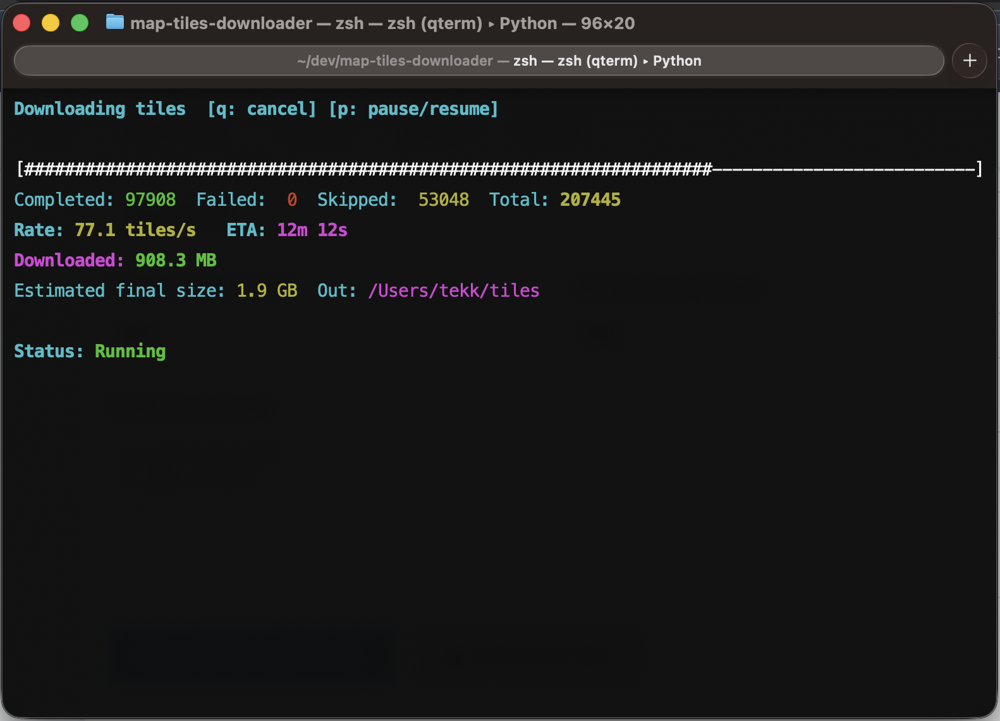

# Map Tiles Downloader

## For Meshtastic & MeshCore

This app helps you fetch map tiles quickly, for offline use. You can pick places using a simple text interface, choose tiles provider and map style, and then download the exact areas that you need. It shows download progress, speed, ETA, and estimates how much disk space will the maps use.

[](https://github.com/tekk/map-tiles-downloader/actions/workflows/ci.yml)
[](https://github.com/tekk/map-tiles-downloader/actions/workflows/release.yml)
[](https://www.python.org/)
[](LICENSE)



## Download

Download the installer/pre-compiled binaries from the Github [Releases](https://github.com/tekk/map-tiles-downloader/releases) page.

## Source code

The source code lives in the GitHub repository: [tekk/map-tiles-downloader](https://github.com/tekk/map-tiles-downloader).

### If you want to compile yourself

First, install the project into a virtual environment. Then launch the interactive interface and follow the prompts. Select one or more continents, countries, and regions, choose a provider (Thunderforest or OpenStreetMap), set zoom levels, and pick an output directory. If the provider needs an API key you’ll be asked for it.

```bash
python3 -m venv .venv
source .venv/bin/activate
pip install -r requirements.txt
pip install -e .
mtd
```

If you prefer commands instead of the guided interface, you can use direct subcommands. Bounding box mode lets you fetch tiles for a given rectangle. KML mode expands points and routes into small areas around each location.

```bash
mtd bbox SOUTH WEST NORTH EAST --min-zoom 3 --max-zoom 12 -o ~/maps/out
```

```bash
mtd kml /path/to/file.kml --min-zoom 3 --max-zoom 12 -o ~/maps/out
```

For Thunderforest, set your API key once per session, or pass it with -k.

```bash
export THUNDERFOREST_API_KEY="your_key_here"
```

You can also preview a download without fetching data to see how many tiles you’ll get.

```bash
mtd bbox 45.9668 5.7767 48.3068 8.7167 --min-zoom 3 --max-zoom 12 --dry-run
```

That’s all you need. Launch the TUI, pick areas, and the downloader will handle the rest.

This project is created and maintained with :heart: by [tekk](https://github.com/tekk).
